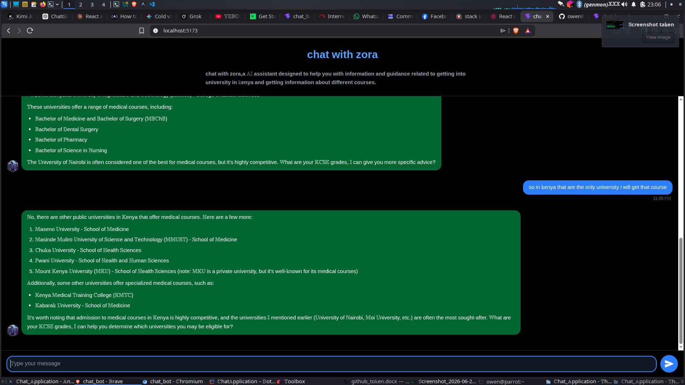

# Zora Chat Application — Monorepo

> An AI-powered university guidance chatbot for Kenyan students, built with a **React (Vite)** frontend and a **Spring Boot** backend.

---

## Screenshot



---

## Repository Structure

```
Chat_Application/
├── ChatApplication/        # 🔧 Backend — Spring Boot (Java 21)
└── chat_bot/               # 🎨 Frontend — React 19 + Vite
```

---

## Quick Links

| Component | Documentation |
|-----------|---------------|
| 🔧 Backend (Spring Boot) | [ChatApplication/README.md](ChatApplication/README.md) |
| 🎨 Frontend (React/Vite) | [chat_bot/README.md](chat_bot/README.md) |

---

## System Overview

```
┌─────────────────────────────────────────────────────────┐
│                     Browser / Client                    │
│                   React + Vite (5173)                   │
└────────────┬───────────────────────┬────────────────────┘
             │  HTTP REST (Axios)    │  WebSocket / STOMP
             ▼                       ▼
┌────────────────────────────────────────────────────────┐
│              Spring Boot Backend (:8080)                │
│  ┌───────────────────────────────────────────────────┐ │
│  │  ChatController  (REST + @MessageMapping)         │ │
│  ├───────────────────────────────────────────────────┤ │
│  │  ChatService  ─────────────────► MongoDB          │ │
│  │  GroqService  ─────────────────► Groq AI API      │ │
│  └───────────────────────────────────────────────────┘ │
└────────────────────────────────────────────────────────┘
```

---

## Getting Started

---

### Prerequisites — Install These Once

Before setting up either project, make sure you have the following installed on your machine:

| Tool | Version | What it's for | Check if installed |
|---|---|---|---|
| **Java JDK** | 21+ | Running the Spring Boot backend | `java -version` |
| **Maven** | 3.8+ | Building the backend (or use `./mvnw`) | `mvn -version` |
| **Node.js** | 18+ | Running the React frontend | `node -version` |
| **npm** | 9+ | Installing frontend packages | `npm -version` |
| **MongoDB** | 6+ | Database (local or cloud Atlas URI) | `mongod --version` |

You also need a **Groq API key** → get one free at [console.groq.com](https://console.groq.com/).

---

### 🔧 Backend Setup (Spring Boot)

> Do this if you want to run the backend server.

```bash
# 1. Navigate into the backend folder
cd ChatApplication

# 2. Create the .env file with your secrets
#    (copy and fill in your own values)
cat > .env << 'EOF'
MONGO_URI=mongodb://localhost:27017/chatdb
GROQ_API_URL=https://api.groq.com/openai/v1/chat/completions
GROQ_API_KEY=your_groq_api_key_here
GROQ_MODEL=llama3-8b-8192
GROQ_MAX_TOKENS=1024
EOF

# 3. Download all Java dependencies and run the app
#    (the ./mvnw wrapper downloads Maven automatically — no separate install needed)
./mvnw spring-boot:run
```

✅ The backend is ready when you see:
```
Started ChatApplication in X.XXX seconds
```
It runs on **`http://localhost:8080`**

> **Note:** If MongoDB is not running locally, start it first with `sudo systemctl start mongod`
> or set `MONGO_URI` in `.env` to a cloud MongoDB Atlas connection string.

---

### 🎨 Frontend Setup (React + Vite)

> Do this if you want to run the chat UI in the browser.

```bash
# 1. Navigate into the frontend folder
cd chat_bot

# 2. Install all npm packages (only needed once, or after pulling new changes)
npm install

# 3. Create the .env file pointing to your backend
echo "VITE_API_URL=http://localhost:8080" > .env

# 4. Start the development server
npm run dev
```

✅ The frontend is ready when you see:
```
  VITE ready in XXXms
  ➜  Local:   http://localhost:5173/
```

Open **`http://localhost:5173`** in your browser.

> **Note:** The backend must be running before you open the app, otherwise the chat history load and WebSocket connection will fail.

---

### Running Both Together (Normal Workflow)

```bash
# Terminal 1 — Start the backend
cd ChatApplication
./mvnw spring-boot:run

# Terminal 2 — Start the frontend
cd chat_bot
npm run dev
```

Then open `http://localhost:5173`.

---

### When Do You Re-run `npm install`?

| Situation | Run `npm install`? |
|---|---|
| First time setting up | ✅ Yes |
| You pulled new code from git and `package.json` changed | ✅ Yes |
| You just want to start the dev server again | ❌ No — just `npm run dev` |
| You deleted `node_modules/` | ✅ Yes |

### When Do You Re-run `./mvnw spring-boot:run`?

Every time you want to start the backend — Maven handles downloading dependencies automatically on first run.
